# comanda

Gestión de pedidos y cola de cocina para restaurantes.

Un restaurante que toma los pedidos en papel tiene dos problemas: la cocina no sabe en qué orden preparar y los meseros no saben qué está listo. Comanda reemplaza la nota de papel por un registro compartido, con una cola ordenada por antigüedad para la cocina y una vista de lo que está listo para el mesero.

## Qué hace

- **Pedidos por mesa.** El mesero registra el pedido y queda asignado a él. Una mesa puede tener varios pedidos.
- **Estados por ítem.** Cada plato del pedido avanza por su cuenta: pendiente, en preparación, listo, entregado. El pedido está completo cuando todos sus ítems lo están.
- **Menú vivo.** Un plato cuyo ingrediente se agota deja de ofrecerse automáticamente.
- **Cancelación con límite.** Un ítem se puede cancelar solo mientras la cocina no lo haya empezado.
- **Cuenta por mesa con pagos parciales.** Varios pagos de monto libre hasta cubrir el total; al llegar a cero la mesa queda libre para una cuenta nueva.

## Alcance

Incluye persistencia de datos, una interfaz web para operar el sistema, las cuatro reglas de negocio y las consultas que resumen el estado.

Queda fuera: autenticación avanzada, pagos reales, despliegue en producción, integraciones externas, impuestos y descuentos.

## Roles

No hay autenticación: el rol y la identidad se eligen entrando directamente a su URL.

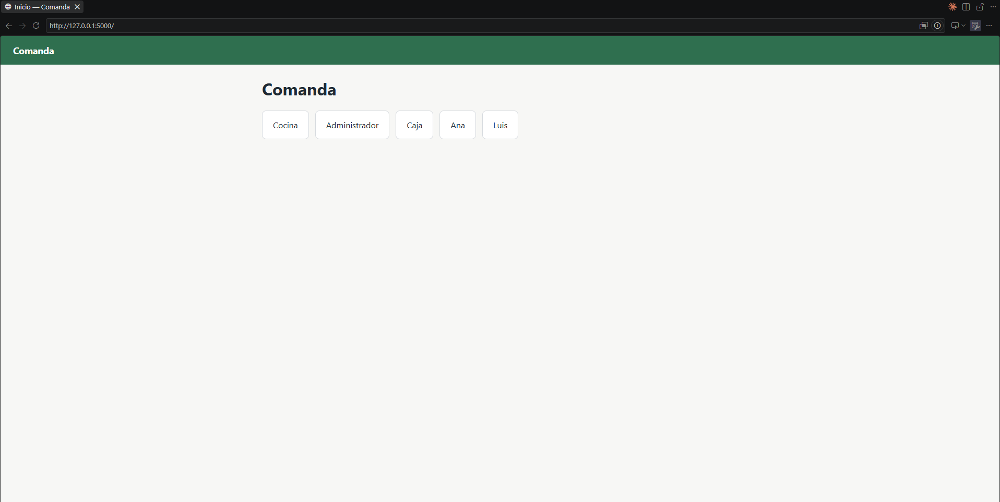

| Rol | Qué hace | Dónde entra |
|---|---|---|
| Administrador | Marca ingredientes como agotados o disponibles, y ve qué platos se están ofreciendo | `/administrador` |
| Cocina | Ve la cola de preparación, inicia, marca listo y cancela ítems pendientes | `/cocina` |
| Mesero | Registra pedidos, ve sus ítems listos y pendientes, marca entregado | `/mesero/<id>` (`1` es Ana, `2` es Luis en los datos de prueba) |
| Caja | Ve la cuenta de cada mesa y registra los pagos parciales | `/caja` |

## Reglas de negocio

1. Cada ítem avanza por sus propios estados: `PENDIENTE → EN_PREPARACION → LISTO → ENTREGADO`, o `PENDIENTE → CANCELADO`. El estado del pedido se calcula a partir de sus ítems.
2. Un plato sin ingredientes disponibles no se puede pedir y deja de ofrecerse.
3. Un ítem se puede cancelar solo si la cocina todavía no lo empezó.
4. La cuenta de una mesa puede dividirse entre varios pagos parciales; la suma nunca supera el total.

Las cuatro se validan en el servidor, dentro de una transacción. La interfaz nunca decide: una operación prohibida se rechaza igual aunque se envíe directamente por HTTP, sin pasar por ningún formulario ni botón.

## Arquitectura

Capas, sin saltos entre ellas. El razonamiento completo y las alternativas descartadas están en [ADR-004](docs/adr/ADR-004-arquitectura.md); el detalle de qué se construye en cada fase, en [docs/PLAN.md](docs/PLAN.md).

```
app/
├── esquema.sql          # Tablas, restricciones e índices. Lo que la base garantiza por sí sola.
├── semilla.sql          # Datos de prueba: 3 mesas, 2 meseros, 6 platos, un ingrediente agotado.
├── db.py                # Conexión por petición, PRAGMA foreign_keys, modo WAL, transacción explícita.
├── reglas.py            # Las cuatro reglas de negocio: operaciones que cambian estado.
├── consultas.py         # Lecturas de solo lectura: cola, vistas por rol, cuenta de una mesa.
├── rutas/               # Un blueprint por rol. Traducen HTTP, no deciden ni escriben SQL.
├── templates/           # Una plantilla por vista, más una base común. No calculan ni consultan.
└── static/estilo.css    # Hoja de estilos única, escrita a mano.
```

SQLite con el módulo estándar `sqlite3`, sin ORM. Flask con plantillas Jinja2, sin frontend aparte.

## Ejecución

Pensado para levantarse en una máquina distinta a la que lo construyó, sin nada instalado de antemano salvo Python. Antes de correrlo ahí, ten en cuenta:

- **Requiere Python 3** (probado con 3.12) y `pip`. No hace falta ningún servicio externo, ni internet después de instalar las dependencias: la base de datos es un archivo que crea el propio comando de inicialización.
- **`.venv/` e `instance/` no van en el repositorio** (están en `.gitignore` a propósito, ver ADR-003): en una máquina nueva no existen todavía, así que los tres primeros comandos son obligatorios, no opcionales.
- Los comandos siguientes son idénticos en Windows, macOS y Linux salvo por cómo se activa el entorno virtual.

**Windows (PowerShell):**

```powershell
python -m venv .venv
.venv\Scripts\activate
pip install -r requirements.txt
flask --app app init-db
flask --app app run
```

**macOS / Linux (bash):**

```bash
python3 -m venv .venv
source .venv/bin/activate
pip install -r requirements.txt
flask --app app init-db
flask --app app run
```

Abre `http://127.0.0.1:5000`. El servidor de desarrollo de Flask no está pensado para producción (lo advierte él mismo al arrancar); es intencional, porque el despliegue está fuera del alcance de este proyecto.

### Reiniciar la base de datos

`init-db` crea la base; no la reinicia. Si ya existe, el comando falla en lugar de sobrescribirla, a propósito: reiniciar es una acción deliberada, no un efecto secundario. Para empezar de cero:

```powershell
Remove-Item instance\comanda.sqlite, instance\comanda.sqlite-wal, instance\comanda.sqlite-shm -ErrorAction SilentlyContinue
flask --app app init-db
```

```bash
rm -f instance/comanda.sqlite instance/comanda.sqlite-wal instance/comanda.sqlite-shm
flask --app app init-db
```

## Recorrido del flujo

El camino completo de un pedido, de la mesa a la cuenta pagada:

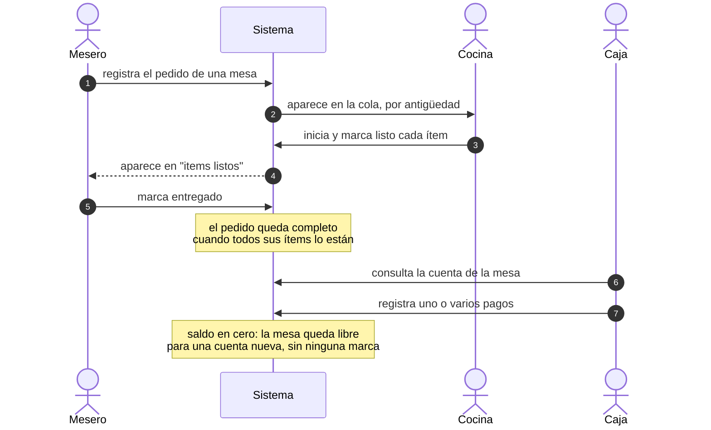

Los diagramas por regla, con los casos de rechazo, están en [docs/PLAN.md](docs/PLAN.md).

Capturas del recorrido anterior en el navegador (pendientes de agregar; ver [docs/capturas/](docs/capturas/) para los nombres de archivo esperados):

**1. Mesero registra el pedido**

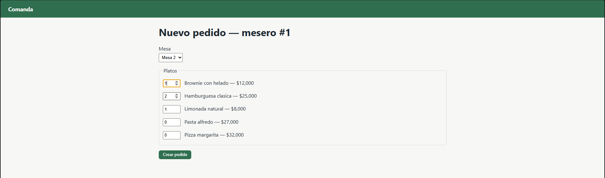

**2. Cocina lo ve en la cola y lo prepara**

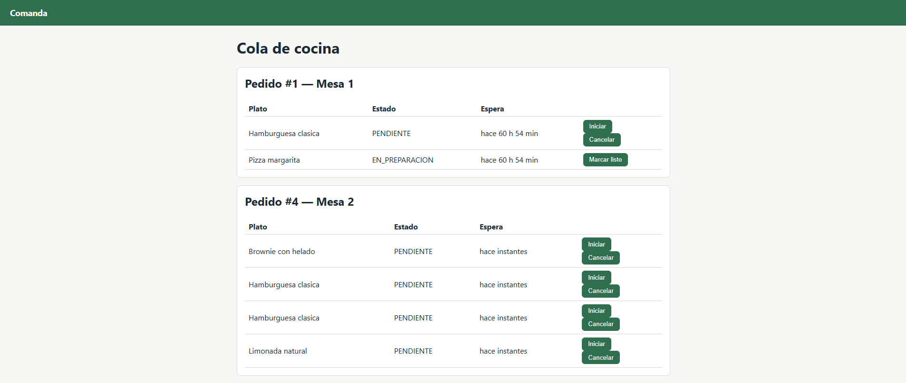
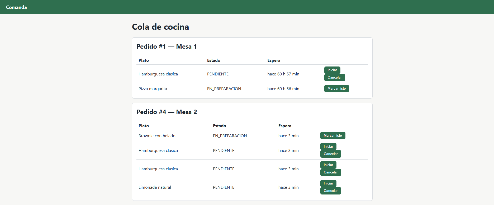

**3. Mesero lo entrega**

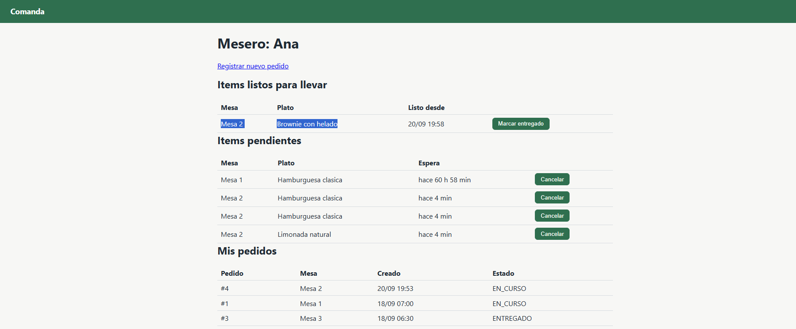
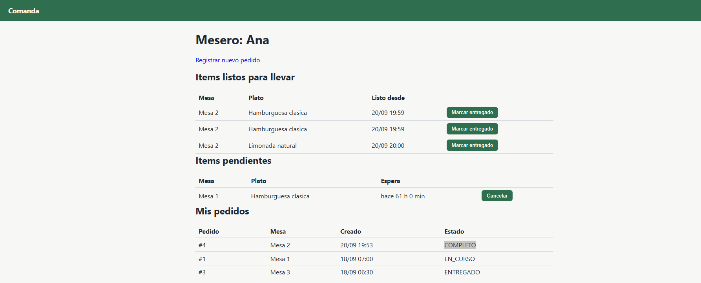
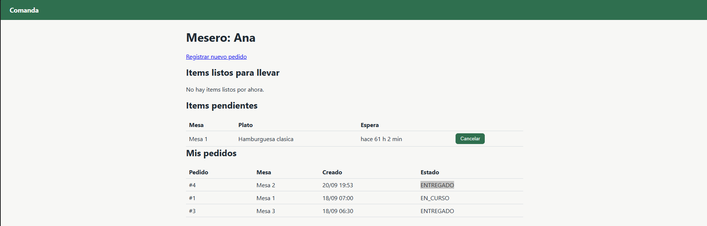

**4. Administrador agota un ingrediente y el menú reacciona**

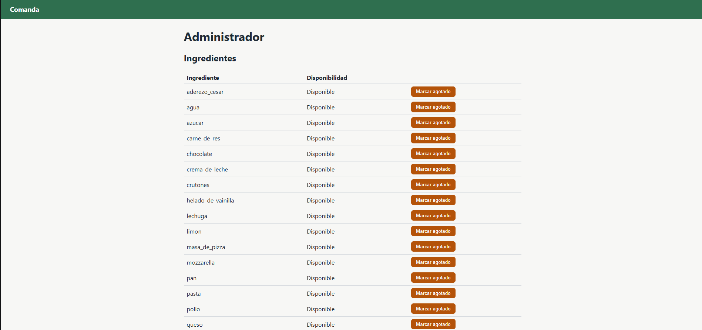
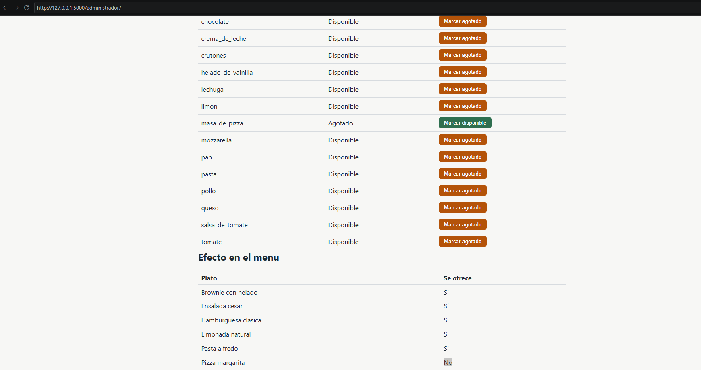

**5. Cancelación de un ítem pendiente**

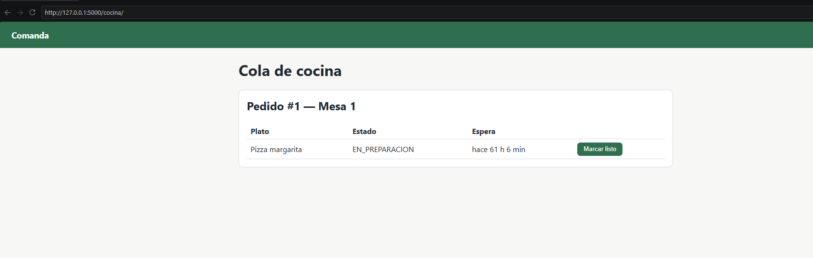

**6. Caja cobra la mesa**

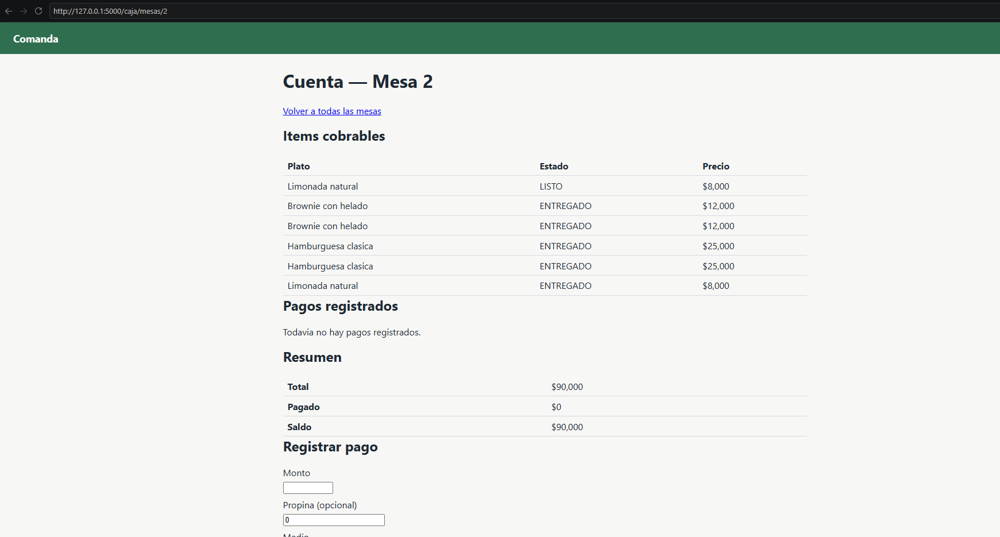
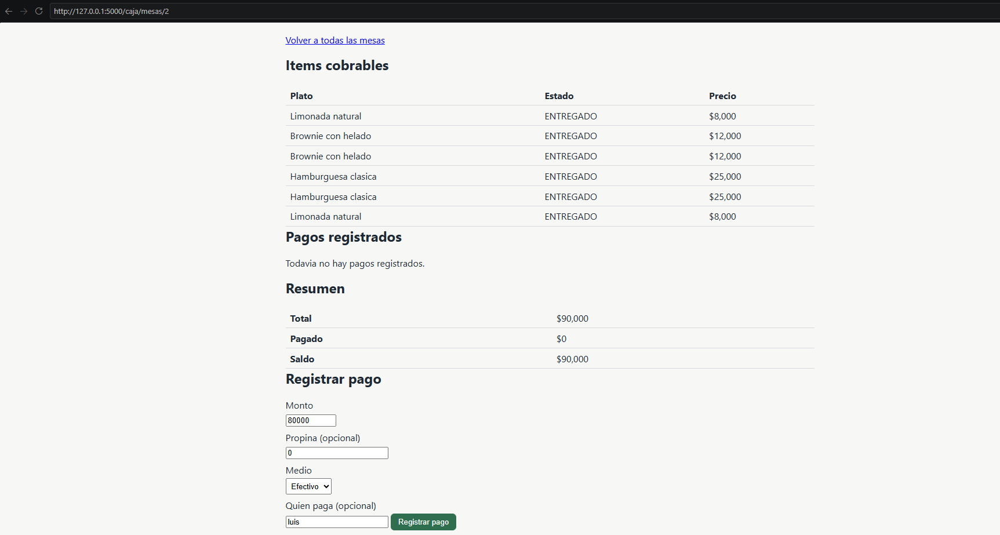
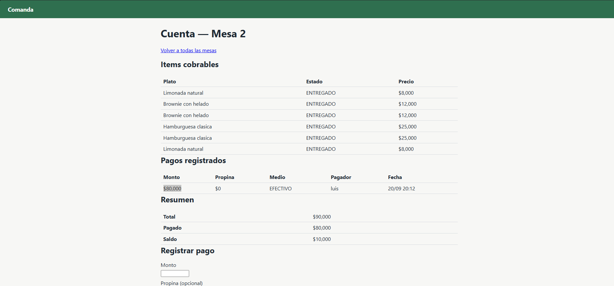
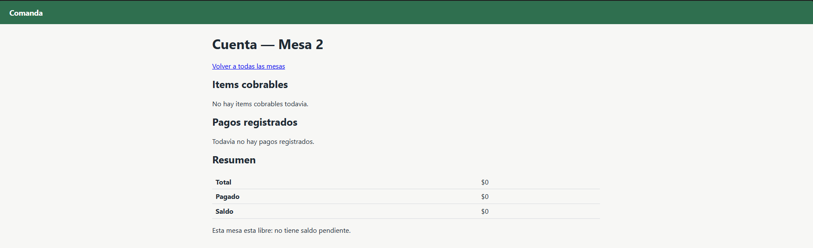

## Criterios de éxito

Obligatorios:

| Criterio | Medida | Umbral | Estado |
|---|---|---|---|
| Las cuatro reglas se cumplen | Un escenario por regla, aceptando lo válido y rechazando lo inválido | 4 de 4 | **Cumplido.** Cada regla se probó aceptando el caso válido y rechazando el inválido, incluido por HTTP directo sin pasar por la interfaz (bitácora, sesiones 5 a 7) |
| No se cancela un ítem empezado | Cancelaciones exitosas de ítems que no están pendientes | 0 | **Cumplido.** Lo bloquea el `UPDATE` condicionado al estado previo, con el `CHECK` del esquema como red de seguridad adicional |
| No se pide un plato sin ingredientes | Ítems creados con un plato no disponible | 0 | **Cumplido.** Verificado agotando un ingrediente y enviando la petición de todas formas, sin pasar por el formulario |
| Los pagos no superan el total | Cuentas con pagos por encima del total, sin contar propina | 0 | **Cumplido.** `registrar_pago` compara el monto contra el saldo dentro de una transacción `BEGIN IMMEDIATE` |
| La cola es correcta | Resultado con datos de prueba conocidos frente al esperado | Coincidencia exacta | **Cumplido.** `EXPLAIN QUERY PLAN` confirma el uso del índice parcial, y el orden por antigüedad se verificó contra `semilla.sql` |
| Nada se pierde | Datos tras reiniciar el servidor | Sin pérdida | **Cumplido.** Probado deteniendo y volviendo a levantar `flask run`: un pedido creado antes del reinicio siguió visible después |
| El README funciona | Levantar el proyecto en otra máquina siguiendo solo estas instrucciones | Sin pasos adicionales | **Pendiente.** Falta probarlo en un entorno realmente limpio, no solo repasado |

Deseables, sujetos al tiempo disponible:

| Criterio | Medida | Umbral | Estado |
|---|---|---|---|
| El mesero ve lo listo rápido | Segundos entre listo y su aparición en la vista del mesero | 5 s o menos | **No cumplido.** La cola de cocina se refresca sola cada 10 segundos; el panel del mesero no tiene refresco automático y depende de que recargue a mano |
| Registro de faltantes | Reportes de cocina visibles para el administrador | Funcionando | **No cumplido, por decisión explícita.** No es ninguna de las cuatro reglas del enunciado; se recortó del alcance para priorizar el flujo principal (bitácora, sesión 6) |
| Propina | Registrada aparte del monto del pago | Funcionando | **Cumplido.** Columna separada en `pago`; verificado que no cuenta para el saldo |
| Pruebas automatizadas | Reglas cubiertas por pruebas | Al menos las 4 reglas | **No cumplido.** La verificación se hizo con scripts manuales por sesión, no con una suite de pruebas que quede en el repositorio |

### Qué queda sin verificar o sin implementar

Para que no quede diluido dentro de las tablas:

- **El README no se probó en una máquina realmente limpia**, solo se repasó contra lo ya construido. Es el único criterio obligatorio todavía pendiente.
- **El panel del mesero no se refresca solo.** Solo la cola de cocina lo hace cada 10 segundos; para ver un ítem recién marcado listo, el mesero tiene que recargar la página a mano.
- **No hay registro de faltantes de cocina.** Se recortó del alcance a propósito por no ser ninguna de las cuatro reglas del enunciado (ver bitácora, sesión 6).
- **No hay pruebas automatizadas en el repositorio.** Toda la verificación de cada sesión se hizo con scripts de un solo uso y con el cliente de pruebas de Flask, sin dejar una suite que se pueda volver a correr.

## Documentación

| Archivo | Contenido |
|---|---|
| [AGENTS.md](AGENTS.md) | Contexto e instrucciones para el agente de IA |
| [ASSUMPTIONS.md](ASSUMPTIONS.md) | Lo que el enunciado no define y se resolvió aquí |
| [BITACORA-IA.md](BITACORA-IA.md) | Registro por sesión de trabajo con la IA |
| [docs/PLAN.md](docs/PLAN.md) | Mapa de capas y fases de construcción, con su criterio de aceptación |
| [docs/adr/](docs/adr/) | Decisiones de arquitectura |

## Sobre el uso de inteligencia artificial

Este proyecto se construyó con apoyo de un agente de IA (Claude Code), bajo dirección explícita en cada tarea. Qué se le pidió en cada sesión, qué propuso, qué acepté, qué rechacé y por qué, y qué quedó sin verificar al cierre de cada una: todo eso está registrado sesión por sesión en [BITACORA-IA.md](BITACORA-IA.md), sin editar después de escrito.

**Lo que decidí yo, no la IA:** el alcance y qué queda fuera de él, cómo resolver cada vacío del enunciado (documentado en [ASSUMPTIONS.md](ASSUMPTIONS.md)), la arquitectura y el motor de persistencia (documentados en los ADR, con las alternativas que descarté y por qué), el orden de las fases de construcción, y el criterio final sobre cada propuesta de la IA: aceptarla, rechazarla o corregirla. Algunos ejemplos concretos que quedaron en la bitácora:

- Rechacé una propuesta de agregar `PRAGMA busy_timeout` porque, al verificarlo en la documentación oficial, el comportamiento que buscaba agregar ya estaba activo por omisión.
- Recorté una validación que la IA adelantó de una fase futura, para que el criterio de aceptación de la fase en curso no quedara borroso.
- Corregí dos veces el modelo de la cuenta de una mesa después de probarlo en el navegador, porque el código cumplía exactamente lo que yo misma había escrito, pero lo que yo había escrito tenía un hueco que no vi hasta usarlo.

**Lo que hizo la IA:** escribir el código bajo esas decisiones, proponer alternativas de diseño cuando se le pidió explícitamente, y señalar contradicciones en mis propias instrucciones antes de resolverlas por su cuenta, en vez de elegir en silencio. No decidió el alcance, ni las reglas de negocio, ni qué se da por terminado.

## Contexto

Proyecto desarrollado como prueba técnica individual de la asignatura Herramientas de Empleabilidad en Ingeniería de Sistemas, Universidad Francisco de Paula Santander, septiembre de 2026. El enunciado se entregó deliberadamente incompleto; los vacíos resueltos están documentados en [ASSUMPTIONS.md](ASSUMPTIONS.md).
