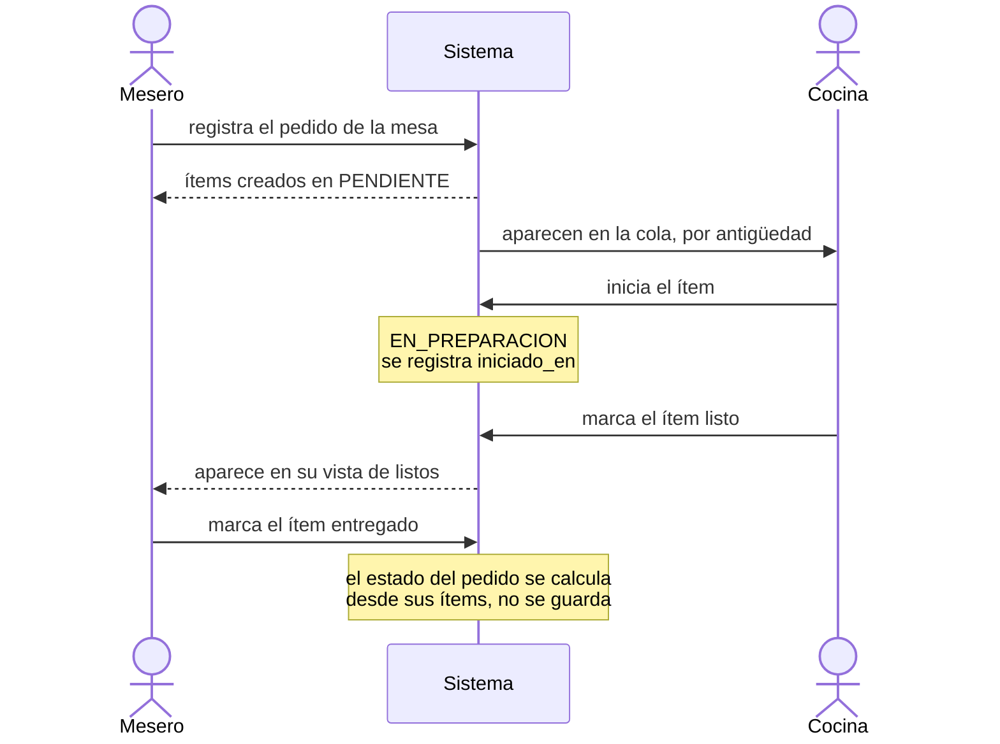

# Plan de trabajo

La arquitectura y su justificación están en [ADR-004](adr/ADR-004-arquitectura.md). Este documento recoge cómo se reparte el trabajo y cuándo se considera terminada cada parte.

## Mapa de capas

Resumen operativo, para saber dónde va cada cosa mientras se construye. El razonamiento y las alternativas descartadas están en el ADR-004.

```
  Navegador
      |
[ templates/ ]      Muestran. No calculan ni consultan.
      |
[ rutas/ ]          Traducen HTTP. No validan reglas ni escriben SQL.
      |
[ reglas.py ]       Deciden. Aquí viven las cuatro reglas de negocio.
[ consultas.py ]    Leen. Consultas de solo lectura, sin efectos.
      |
[ db.py ]           Conecta y configura.
[ esquema.sql ]     Garantiza. Restricciones que ningún código puede saltarse.
      |
   SQLite
```

Ninguna capa se salta a la siguiente: una plantilla no consulta la base de datos, una ruta no escribe SQL, `reglas.py` no sabe que existe HTTP.

### Dónde se garantiza cada regla

| Regla | Dónde |
|---|---|
| 1. El pedido está completo cuando todos sus ítems lo están | `consultas.py`, calculado desde los ítems. `pedido` no tiene columna de estado |
| 2. Un plato sin ingredientes no se ofrece ni se puede pedir | `consultas.py` para no ofrecerlo, `reglas.py` para rechazar el intento |
| 3. Un ítem se cancela solo si no empezó | `reglas.py` con el UPDATE condicionado, más el `CHECK` del esquema como red de seguridad |
| 4. La cuenta admite pagos parciales | `reglas.py`, dentro de una transacción explícita |

---

## Fases

Seis fases. Cada una tiene un criterio de aceptación verificable: mientras no se cumpla, no se pasa a la siguiente.

### F0. Especificación — completada

Definir qué se construye y con qué, antes de escribir código.

- Propósito, alcance y roles.
- Supuestos sobre los vacíos del enunciado.
- Decisiones de herramienta, lenguaje, persistencia y arquitectura.

**Criterio de aceptación:** existen README, AGENTS.md, ASSUMPTIONS.md, los ADR y la bitácora, y las cuatro reglas están expresadas como invariantes verificables.

*Nota: el ADR-004, sobre arquitectura, se redactó durante F1, al replantear si convenía un modelo orientado a eventos.*

### F1. Persistencia — completada

La base de datos existe y sus garantías funcionan.

- `esquema.sql` con tablas, restricciones e índices.
- `semilla.sql` con datos de prueba, incluido un plato sin ingredientes disponibles.
- `db.py` con conexión por petición, claves foráneas activas y modo WAL.

**Criterio de aceptación:**
1. Un comando crea la base desde cero.
2. `PRAGMA foreign_keys` devuelve 1 y `PRAGMA journal_mode` devuelve wal.
3. Insertar un ítem con un pedido inexistente falla.
4. La consulta de la cola devuelve los datos semilla en el orden correcto y `EXPLAIN QUERY PLAN` confirma que usa el índice parcial.

### F2. Flujo principal — completada 

El recorrido completo de un pedido, de punta a punta. Es la fase que no puede faltar: sin ella no hay sistema.



- `reglas.py` con las transiciones de estado.
- `consultas.py` con la cola de cocina y la vista del mesero.
- Rutas y plantillas por rol.
- Recarga periódica en la pantalla de cocina.

**Criterio de aceptación:** se puede crear un pedido en el navegador, verlo aparecer en la cola, avanzarlo hasta entregado, y el pedido queda completo cuando todos sus ítems lo están. Las transiciones inválidas se rechazan aunque se envíen directamente por HTTP, sin pasar por la interfaz.

*Nota: al ejecutar el flujo apareció que el estado del pedido retrocedía tras la entrega. El código cumplía el supuesto A-05, pero ese supuesto no contemplaba el estado posterior a entregar. Se corrigió con cuatro estados calculados y se actualizó A-05.*

### F3. Disponibilidad y cancelación — En curso

Las reglas 2 y 3.

```mermaid
sequenceDiagram
    autonumber
    actor admin as Administrador
    actor mesero as Mesero
    participant sistema as Sistema
    actor cocina as Cocina
 
    rect rgba(190, 120, 120, 0.12)
        Note over admin, cocina: Regla 2 — un plato sin ingredientes no se ofrece ni se puede pedir
        admin->>sistema: marca un ingrediente como agotado
        Note over sistema: la disponibilidad se calcula desde la receta;<br/>no hay columna que la guarde
        sistema-->>mesero: el plato desaparece del menú
        mesero->>sistema: lo pide igualmente, sin pasar por el menú
        sistema-->>mesero: RECHAZADO, dentro de la transacción
    end
 
    rect rgba(110, 150, 200, 0.12)
        Note over admin, cocina: Regla 3 — un ítem se cancela solo si la cocina no lo empezó
        cocina->>sistema: cancela un ítem en PENDIENTE
        sistema-->>cocina: CANCELADO, se registra cancelado_en
        cocina->>sistema: inicia otro ítem
        Note over sistema: EN_PREPARACION,<br/>se registra iniciado_en
        cocina->>sistema: intenta cancelar el que ya inició
        sistema-->>cocina: RECHAZADO por el UPDATE condicionado y por el CHECK
    end
```

- Administrador marca ingredientes como agotados o disponibles.
- Un plato sin receta o con un ingrediente agotado desaparece del menú.
- Cocina y mesero cancelan ítems pendientes.
- Cocina registra faltantes para el administrador.

**Criterio de aceptación:** un plato con un ingrediente agotado no aparece en el menú del mesero, y el intento de pedirlo por HTTP se rechaza. Un ítem ya iniciado no se puede cancelar por ninguna vía.

### F4. Cuenta y pagos — Pendiente

La regla 4.

- Cuenta por mesa, con el total de los ítems no cancelados.
- Registro de pagos parciales por monto libre.
- Cierre de la mesa cuando el saldo llega a cero.

**Criterio de aceptación:** la suma de los pagos nunca supera el total, no se acepta un pago si quedan ítems sin entregar, y los ítems cancelados no se cobran.

### F5. Cierre — Pendiente

**Condición de arranque:** F2 debe estar terminada y publicada. Si el flujo principal no corre, el tiempo de esta fase se usa en terminarlo, no en documentar.

- Instrucciones de ejecución en el README, probadas desde cero.
- Bitácora al día.
- Revisión de los criterios de éxito: cuáles se cumplieron y cuáles no, con el motivo.
- Repaso del código generado que no se haya leído todavía.

**Criterio de aceptación:** alguien que clone el repositorio puede levantar el sistema siguiendo solo el README, y cada criterio de éxito está marcado como cumplido o no cumplido con su justificación.

---

## Orden de prioridad si el tiempo se acaba

F1, F2, F5, F3, F4.

Un sistema con el flujo principal funcionando, bien documentado y con las reglas faltantes declaradas como no implementadas vale más que uno con las cuatro reglas a medias y sin instrucciones de ejecución.