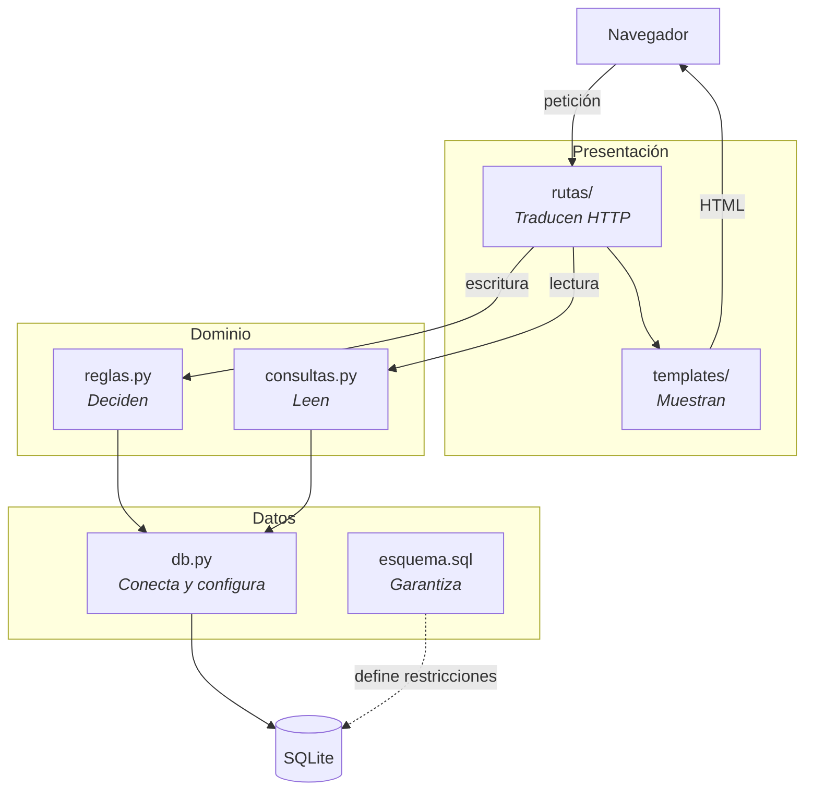

# ADR-004. Arquitectura en capas con procesamiento síncrono

**Estado:** aceptada
**Fecha:** 19 de septiembre de 2026

## Contexto

El dominio del sistema se parece a una cola de trabajo: los pedidos entran, la cocina los procesa en orden y los meseros reciben avisos de que algo está listo. Esa forma sugiere de entrada una arquitectura orientada a eventos, donde cada acción publica un mensaje y un proceso separado lo atiende.

Hay que decidir dos cosas distintas que suelen confundirse:

1. **Cómo se organiza el código por dentro:** qué componente puede llamar a cuál.
2. **Cómo se procesan las operaciones:** de forma síncrona, dentro de la misma petición, o asíncrona, publicando un evento que se atiende después.

La restricción que domina la segunda decisión es que las reglas de negocio deben validarse dentro de una transacción, de modo que una operación prohibida quede rechazada en el momento y no después. Dos de ellas pueden romperse por concurrencia: cancelar un ítem que la cocina acaba de iniciar, y registrar dos pagos simultáneos que juntos superan el total.

Además, quien opera el sistema necesita una respuesta inmediata. Un mesero que cancela un plato tiene que saber en ese instante si se canceló o si la cocina ya lo empezó, porque de eso depende lo que le dice al cliente.

## Decisión

**Arquitectura en capas, con procesamiento síncrono dentro de cada petición.**

Cuatro capas, y ninguna se salta a la siguiente:

 
**Lo que el diagrama hace visible:** no hay ninguna flecha que salte una capa. El navegador no llega a `reglas.py`, las plantillas no tocan `db.py`, y ninguna ruta llega a SQLite directamente.
 
La flecha punteada de `esquema.sql` es distinta a propósito: no es una llamada en tiempo de ejecución, sino las restricciones que quedan grabadas en la base de datos y se aplican a toda escritura, venga de donde venga.

## Alternativas descartadas

### Arquitectura orientada a eventos con procesamiento asíncrono

Cada acción publicaría un evento (`ItemCancelado`, `ItemIniciado`) en una cola, y un proceso trabajador lo atendería después. Encaja bien con la metáfora del dominio y escalaría a varias sedes o varias cocinas.

Se descartó por tres razones, la primera de las cuales es decisiva:

**Debilita las garantías en lugar de reforzarlas.** Entre publicar un evento y procesarlo pasa tiempo, y en ese intervalo el estado puede cambiar. Si un mesero publica "cancelar ítem 42" y trescientas milésimas después la cocina publica "iniciar ítem 42", el resultado depende del orden en que se procesen los mensajes. Garantizar ese orden, detectar la inconsistencia y deshacerla con una transacción compensatoria es considerablemente más difícil que resolverlo con una sola sentencia condicionada al estado previo, que es lo que permite el procesamiento síncrono.

**La interfaz necesita respuesta inmediata.** Un modelo asíncrono responde "solicitud recibida". Al mesero que está frente al cliente eso no le sirve: necesita saber si la cancelación procedió.

**Exige infraestructura que el proyecto descartó.** Un broker de mensajes o un proceso trabajador aparte contradice la decisión de ADR-003 de no instalar servicios adicionales, y añade un componente más que entender y sostener.

### Arquitectura en tres capas con una capa de servicios genérica

Una variante habitual sería una capa de servicios que orqueste repositorios por entidad. Se descartó porque en un sistema de este tamaño produce una clase por tabla sin comportamiento propio, y diluye las reglas de negocio entre varios archivos en vez de concentrarlas donde se pueden señalar.

### Sin capas, con la lógica en las rutas

Es lo más rápido de escribir y lo que produce un agente por omisión si no se le indica otra cosa. Se descartó porque haría que las reglas vivieran junto al manejo de HTTP, que es exactamente lo que la regla de oro prohíbe: una regla en la ruta es una regla que depende de la interfaz.

## Consecuencias

**A favor:**
- Las reglas de concurrencia se resuelven con una sentencia condicionada al estado previo, sin coordinación entre procesos.
- Cada regla de negocio tiene una ubicación única y localizable.
- No hay procesos adicionales que arrancar ni supervisar: el sistema es un solo programa.

**En contra, y asumido:**
- El sistema no escala a varias sedes ni a varios servidores de aplicación. Es coherente con el alcance de un solo restaurante y con la elección de SQLite.
- La pantalla de cocina se actualiza por recarga periódica, no en vivo. Actualizarla sin recargar exigiría eventos enviados por el servidor o WebSockets; queda registrado como mejora posible, no implementada.
- Las capas imponen escribir algo más de código que poner la lógica directamente en las rutas.

**Lo que sí se conserva del modelo de eventos.** El diseño incorpora la parte útil de ese enfoque sin su infraestructura: cada transición de estado es un evento con nombre dentro de una máquina de estados explícita, las marcas de tiempo por transición son el registro de esos eventos, y la cola de cocina es una cola real que se consulta por antigüedad. Lo que no se adopta es el procesamiento diferido.

## Referencias

- `docs/PLAN.md`, sección de arquitectura, con el detalle de dónde se garantiza cada regla.